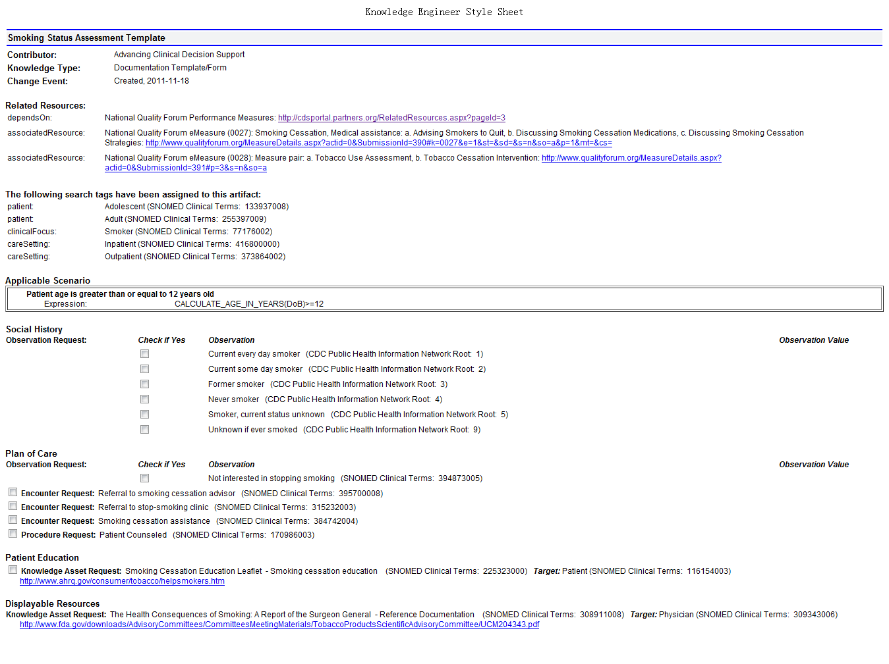
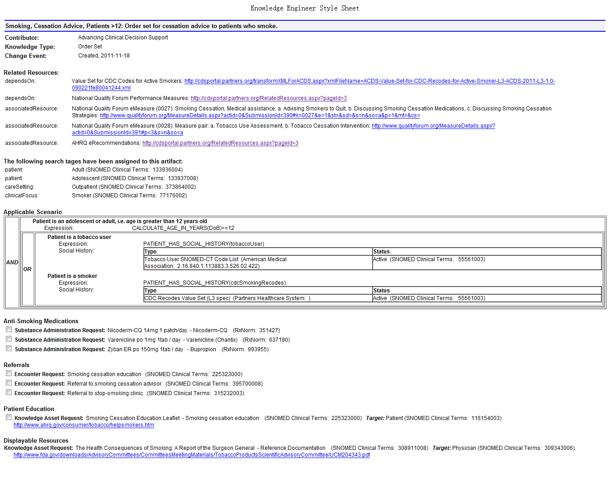
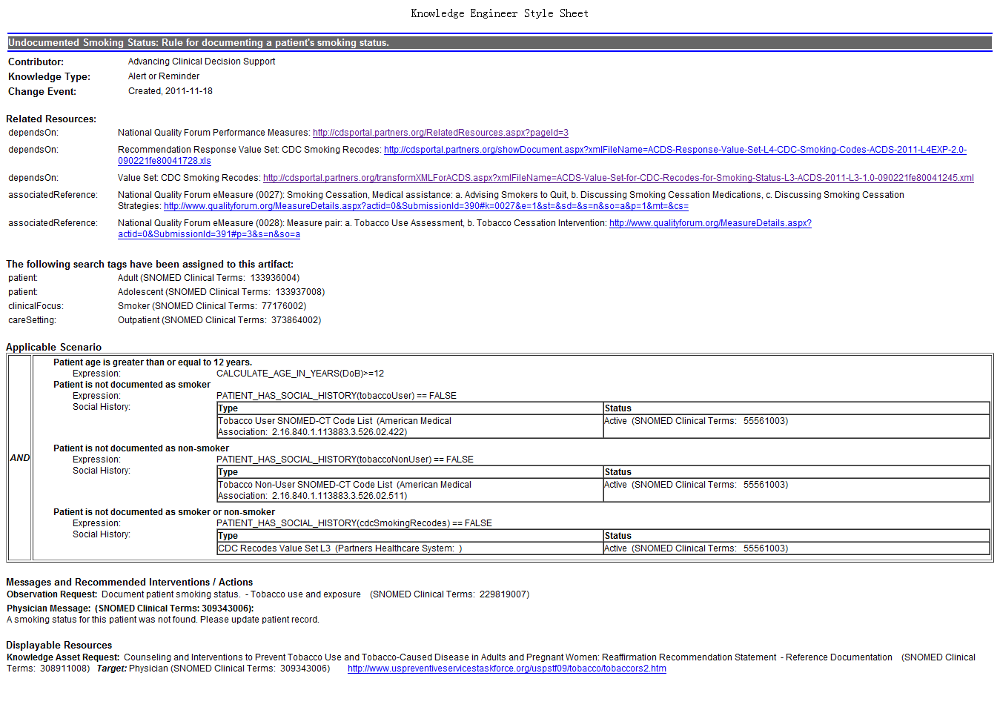

# CDS Sharing

由ONC赞助的***Advancing Clinical Decision Support (ACDS)***项目中美国联盟医疗体系（Partners HealthCare System）的Dr. Tonya Hongsermeier提出了一种**知识共享**服务的标准schema、管理模型和功能架构。其中
a)确定知识共享服务Knowledge Sharing ServiceKSS的关键需求和特性
b)提出管理模型和编辑策略的重要属性
c)提出一个基于已有标准的框架
d)提出可以表达常见的干预类型的XML schema
e)确定现有标准存在的局限性 提出改进意见
f)部署第一版KSS
g)针对MU中的CDS 干预措施，提供XML的实现，配套XSLT文件可以展示成html形式

The Clinical Decision Support Consortium (CDSC)知识管理门户中提供对CDS干预措施的检索，其中既包含非结构化的纯文本形式的临床指南，也包括了结构化的CDS逻辑规则。可以通过学科类型、贡献机构和知识类型等关键词来检索。
这个门户网站是由AHRQ赞助的**CDSC项目**的一部分，目前包含了80种，35个是为ACDS项目开发的，45个是为CDSC项目开发的。涵盖的类型包括了alert/reminders、文档模板、医嘱套餐、参考信息、infobutton、和值集。格式要么是XML格式 要么是HTML形式的。

以戒烟为例，在该网站上进行检索

参考资料
- [CDSC知识门户](http://cdsportal.partners.org/)
