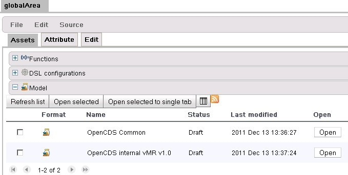

 # openCDS系列 II——使用openCDS中的概念 
[最先发布与科学网博客  openCDS系列 II——使用openCDS中的概念 ](http://blog.sciencenet.cn/blog-615874-579243.html)
1 什么是openCDS中的概念
1.1 概念类型
1.2 openCDS中的概念
1.3 概念映射规范
1.4 概念映射实例
2 Guvnor中的概念
2.1 概念类型
2.2 以openCDS中的概念作为Guvnor中的枚举
2.3 特定领域语言dsl
2.4 Guvnor中的概念映射
3 OpenCDS决策支持服务中的概念
3.1 OpenCDS内部数据中的概念类型
3.2 OpenCDS 内部数据、概念映射规范和概念映射实例
3.3 对OpenCDS概念映射规范和概念映射的更新

## 简介

OpenCDS是基于临床概念的思路构建的临床决策支持系统。我们将很多术语系统和医学信息交换系统称之为概念、概念描述符、或者是概念唯一标识符。
当我们提到一个OpenCDS概念时 我们指的是OpenCDS中所使用的特定的实现技术，它们与这些基本想法保持独立，但是更加具体的实现。
本文的目的在于阐述我们如何在OpenCDS使用这些术语，以及它们与临床上广义上理解的概念的关系。
1.什么是OpenCDS中的概念
OpenCDS中的概念是OpenCDS中一种实现技术。作为一个全局概念，OpenCDS拥有一种结构和方法，使得临床用户能够适用临床概念来开发决策支持规则。我们称这些特定的概念为OpenCDS中的概念，它们能够为表示临床概念实例的具体数据提供一个接口。
这意味着临床规则编辑人员能够利用医务人员能够理解的临床术语来工作。OpenCDS旨在支持为开源的Drool推理引擎编辑的规则，其中使用一种特定领域语言。这种特定领域语言使得可以如医务人员描述的那样来编辑规则，使用医务人员平常所使用的一些术语。
然后医学信息学人员、术语人员或词汇专家将这些概念与中实际临床数据中使用的编码系统中的值对应起来。很多情况下，这涉及到使用大型数据库的术语管理系统，如Apelon First DataBank 以及UMLS，这些能够支持大型和国际化的术语。然而，也可以通过构建简单的XML文件来实现专有代码或特殊代码与OpenCDS概念的对应。

临床规则使用OpenCDS概念要优于原始数据，多个不同的编码系统之间术语映射使得这些概念就是一些代码列表。这样就可以将规则的逻辑与规则所使用的具体数据分离开来。
因此，OpenCDS中的概念是医学想法与表达临床概念实例的数据细节的接口。
本节下面的部分会阐述如下项目，讨论它们在OpenCDS如何使用
* 概念类型
* OpenCDS中的概念
* 概念实例
* 概念映射和枚举
下图可以很容易的看出它们间的关系

下面的章节会讨论如下软件中将病人数据与临床概念或想法关联起来的技术：
1.JBoss Drools Guvnor (our supported authoring environment for KnowledgeModules, aka “rules” or generically as “knowledge”)
2.OpenCDS Decision Support Service (our software service to do clinical decision support) 

1.1 概念类型
1.1.1定义
OpenCDS中的概念类型是一个术语，我们常常指的是OpenCDS中的java类，它们是为结构化成vmr的输入数据中找到的
每个概念描述符和模板而构建的。
一个概念类型表示在临床声明中很多地方都能找到的一类信息。临床声明是vmr的基石，有关vmr更多的讨论可以在Notes on OpenCDS internal Data Structure 中找到。另外 也有一些处理模板和vmr结构化元素的概念类型。

在本文中，我用大写的Concept Type来表示java类，而用小写的来表示通常的concept概念。
有时候，在输入数据中我们也会post-coordinated不止一个CD,例如bodysite身体部位和laterality侧面，因为可能需要对这两种的组合做出一些决策，或者手术/操作和问题的常见的编码系统可能没有足够特殊的代码，我们需要将二者关联起来来表示。比如，我们想表示皮疹同时出现在左右胳膊上。

Concept Type的例子有 “ProcedureConcept,”、“AdverseEventAgentConcept,”、ProblemConcept”,“MedicationClassConcept.” 

因为它们都是基于vmr中的一些特殊数据元素，OpenCDS支持的Concept Type的列表是固定的，包括很少的能够满足大多数其他分类的需要。当需求出现时，我们能够添加更多的Concept Type，我们认为当前的列表是可用的。支持额外的Concept Type不是件小事，所以不常常这么做。

所支持的Concept Type的列表总能够在源代码中找到，它们是位于module opencds-vmr-1_0-internal中的单独的文件，是org.opencds.vmr.v1_0.internal.concepts.中单独的java类。这些文件的名称就是Concept Type，你可以在Drool rule中找到。出于其他目的在org.opencds.common.terminology.OpenCDSConceptTypes.java中也有单独的罗列出来。
在本文档成文的时候 有如下的Concept Types

AdverseEventAffectedBodySiteConcept

AdverseEventAffectedBodySiteLateralityConcept

AdverseEventAgentConcept

AdverseEventConcept

AdverseEventCriticalityConcept

AdverseEventSeverityConcept

AdverseEventStatusConcept

BrandedMedicationConcept

CDSInputTemplateConcept

CDSOutputTemplateConcept

ClinicalStatementEntityInRoleRelationshipConcept

ClinicalStatementRelationshipConcept

ClinicalStatementTemplateConcept

DataSourceTypeConcept

DoseTypeConcept

DosingSigConcept

EncounterCriticalityConcept

EncounterTypeConcept

EntityRelationshipConcept

EntityTemplateConcept

EntityTypeConcept

EthnicityConcept

EvaluatedPersonRelationshipConcept

GenderConcept

GenericMediccationConcept

GoalCodedValueConcept

GoalCriticalityConcept

GoalFocusConcept

GoalStatusConcept

GoalTargetBodySiteConcept

GoalTargetBodySiteLateralityConcept

ImmunizationConcept

InformationAttestationTypeConcept

InformationRecipientPreferredLanguageConcept

InformationRecipientTypeConcept

ManufacturerConcept

MedicationClassConcept

MedicationConcept

ObservationCodedValueConcept

ObservationCriticalityConcept

ObservationFocusConcept

ObservationInterpretationConcept

ObservationMethodConcept

ObservationTargetBodySiteConcept

ObservationTargetBodySiteLateralityConcept

ObservationUnconductedReasonConcept

PreferredLangugageConcept

ProblemAffectedBodySiteConcept

ProblemAffectedBodySiteLatgeralityConcept

ProblemConcept

ProblemImportanceConcept

ProblemSeverityConcept

ProblemStatusConcept

ProcedureApproachBodySiteConcept

ProcedureApproachBodySiteLateralityConcept

ProcedureConcept

ProcedureCriticalityConcept

ProcedureMethodConcept

ProcedureTargetBodySiteConcept

ProcedureTargetBodySiteLateralityConcept

RaceConcept

ResourceTypeConcept

RoleConcept

SubstanceAdministrationApproachBodySiteConcept

SubstanceAdministrationApproachBodySiteLateralityConcept

SubstanceAdministrationCriticalityConcept

SubstanceAdministrationGeneralPurposeConcept

SubstanceAdministrationTargetBodySiteConcept

SubstanceAdministrationTargetBodySiteLateralityConcept

SubstanceDeliveryMethodConcept

SubstanceDeliveryRouteConcept

SubstanceFormConcept

SubstanceManufacturerConcept

SupplyConcept

SupplyCriticalityConcept

SupplyTargetBodySiteConcept

SupplyTargetBodySiteLateralityConcept

SystemUserPreferredLanguageConcept

SystemUserTaskConctextConcept

SystemUserTypeConcept

UndeliveredProcedureReasonConcept

UndeliveredSubstanceAdministrationReasonConcept

VmrOpenCdsConcept

VMRTemplateConcept

2. OpenCDS Concepts
2.1定义
OpenCDS Concept就是指OpenCDS Concept Type的一个特殊的实例，它能够在决策支持的语境中标识一个医师熟悉的或有用的临床概念，并且是在OpenCDS中通过Apelon DTS分配一个id ，是可标识的。
每个OpenCDS Concept都可能是某个特殊的OpenCDS KnowledgeModule的某个Concept Type的0到多个实例之一，

比如，ProblemConcept的实例可能是 diabetes mellitus, asthma, or chronic heart disease,可能有更多其他的。MedicationClassConcept 的实例可能有bronchodilator支气管扩张剂, or ACE inhibitor等等。

我们为了保证所有OpenCDS用户的 知识模块间的互操作性，对 OpenCDS Concept code进行集中式管理，这样不同的组织就能够共享知识模块。

 在软件和知识模块开发时，可以通过OpenCDS 配置文件创建临时的  OpenCDS Concept，但是任意临时的 OpenCDS Concept都应该添加到中央的 OpenCDS Concept 列表中，这个列表部署在Apelon DTS 术语服务器上，是由犹他大学负责维护的 。将概念添加到OpenCDS Apelon 实例中会为其分配一个唯一ID，这样所有OpenCDS的实现人员就可以使用。

如下步骤就可以浏览此服务器的内容：
登录Apelon.opencds.org网站
使用如下参数登录 其中密码为welcome2opencds

The master set of concepts can be generated for local use within the OpenCDS service from this central Apelon repository using a utility in the opencds-decision-support-service module named org.opencds.terminology.OpenCDSConceptsFileCreator. 

3概念映射规范

定义

OpenCDS中的概念映射规范是OpenCDS的一个概念，其中有一个与之关联的Determination方法，可能会或不会指定一个与之相关的编码系统。
为每一个OpenCDS中的概念创建一个或多个概念映射规范是很常用的。一般地概念映射规范会得到相关的编码系统的code的集合，这些code能够满足与之相关的determination方法的要求，当用在概念实例上时我们简单的称之为概念映射。然而，即使没有映射的实例也可以构建一个概念映射规范。

我们常常没有区分有映射的概念实例和无映射的概念实例，因为定义映射规范一般是构建映射的第一步。而，将概念映射规范与映射到概念区分开来是很有用的，因为这是两个步骤：每个OpenCDS Concept可能有多个概念映射规范，对于每个概念映射规范特定的code可能有多个映射实例。
Associated Determination Method
OpenCDS中概念映射规范的一个重要属性就是总是有一个与之相关的determination method.这样就可以根据不同的需求构建类似的概念映射。当你要处理一个由某些职能部门如HEDIS 或NQF定义的概念时特别有用。这些机构一般都有自己特殊的code列表和编码系统来描述他们感兴趣的特定概念。
为特殊的概念实例定义属于你自己的determination method.也是可以的。可能包括 “best available,” “in approved formulary,” “board approved,” “expensive,” or “cost effective,”等等。背后的思路是将特殊code实例和编码系统与通用概念对应起来的条件加以标注。
单一 OpenCDS Concept拥有多个determination method也是可行的，在同一系列的rule中使用不止一个也是可能的。比如，你可能需要区分你的特殊医学场景下讨论糖尿病的NQF determination method, the HEDIS determination method, and the best available determination method。

然而一般地，在一个特殊的知识模块中你可能只想要一个determination method。我们包含了一个DSL的例子来为rule选择determination method，但是你可以根据自己的需要来使用他们。
(1)       Associated Code System
OpenCDS中概念映射规范的第二个重要属性是它可能与某个特殊的code system关联。这意味着不同的编码系统如LOINC, CPT, ICD9, ICD10, SNOMED-CT, RXNORM, proprietary in-house systems,，OpenCDS中中可能有不同的概念实例
总结一下的话，OpenCDS concept mapping specification会与一个 OpenCDS Concept关联，能够标识一个 OpenCDS Concept的特殊实例，其中对于不同的编码系统可能有多个不同的determination methods。典型的concept mapping specification的名称中包含对 clinical concept和determination method, and possibly the code system.的引用，

值得注意的是概念实例的名称没有计算机化的值，它是描述性的，只是为了人们理解。在OpenCDS启动时，不管文件名称，目录中所有文件都被装载，尽管我们想给文件一些有意义的名称。所有计算机化的知识都是位于概念实例的xml之中。
1. Concept Mapping Instances
定义
OpenCDS中的概念验证实例指的是将一个概念映射规范与来自相关的determination 方法指定的
零到多个相关的编码系统的code联系起来。

概念映射实例包含CD元素（编码系统和编码）的集合，其中暗含或者指定了与概念映射规范相关的临床概念（又叫做OpenCDS 概念）。两种情况下，它们存储以及检索的地方被称之为知识库。Knowledge Repository.
在很多情况下 映射只构建一次，然后就是不常见的在这个基础上更新。其他情况下 特别是在药物中，可能需啊哟与术语服务器实时连接来查询最新的映射，因为它们变化地很频繁。在未来OpenCDS的版本中会加入术语服务的这种实时查询。
对于OpenCDs而言，可以通过如下方法来构建存储映射的文件：
Apelon DTS和包含在OpenCDS中的内嵌接口来生成XML文件；
可以生成XML文件的其他术语管理系统；
手动编辑XML文件
自动得到的概念映射与手动构建的单独存储（比如files constructed by any method other than download from Apelon
 ）以免疏忽大意覆盖了手动的概念映射。

概念映射意在以分布式的方式由多个参与者在本地维护，这与知识模块类似。与
  这与OpenCDS Concepts相反，它是要集中式维护的。
2          Concepts in Guvnor
尽管可以不使用Guvnor来为OpenCDS编辑rule，不引用任意的OpenCDS Concepts，我们支持Gnvor,也推荐根据OpenCDS Concepts来编辑你的rule。Guvnor和OpenCDS Concepts的组合能够得到rule，它们是可视化的且有易于理解的逻辑，可以直接由医师来核对其准确性。
Guvnor是一个工具，它能够完成两件事：
1编辑rule （我们有时候也称之为有关临床概念的知识）
2.测试这些rule的逻辑上的有效性

在Guvnor中为你的rule编写完整的测试是一种良好的实践，在知识模块（也就是 Guvnor中的Package）中rule有任意改变时都要运行它们。Guvnor中可以直接点击运行某个package的所有测试来完成。

1. Concept Types
定义 OpenCDS中的Concept Types的java类是通过导入名为opencds-vmr-v1_0-internal的OpenCDS
模块得到的。然后你就可以得到在web服务中可以使用的Concept Types。你也会需要OpenCDS 的通用jar，他们是opencds-common.模块。

如果选择Edit标签而不是Assets标签，你就可以查看模型的内容/

如果点击Advanced View按钮，你就能以文本形式编辑模型，你需要这样来做，   

当你导入了OpenCDS的两个jar包，在Guvnor中构建了一个新模型之后，它们的顺序是随机的，也会包含一些你不要的元素。我们提供了一个排好序的导入声明，在你删除得到的内容之后，你可以将其复制到该窗口。该排好序的列表在OpenCDS
 源代码中的名称为ImportStatementsForOpenCDSGuvnor.txt 位于opencds-vmr-1_0-internal module之中。

每次更改之后别忘了验证、构建和保存模型。

一旦你定义好了模型就不用再管它。更改模型可能会破坏基于这个模型的rule。